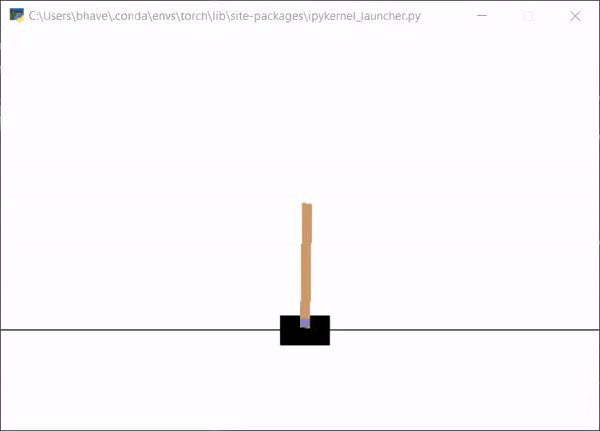

# Intro to Neuroevolution

Neuroevolution is the application of genetic algorithms to optimize the parameters and/or topology of a neural netwwork.

This repository contains the code for the second part of the webinar series I am doing on Evolutionary AI. In this session, I demonstrate the basics of neuroevolution by evolving a population of fixed topology neural networks to balance a cartpole.

The webinar series can be accessed here:
1. [Genetic Algorithms](https://www.meetup.com/Disrupt-4-0/events/271033356/)
2. [Intro to NeuroEvolution](https://www.meetup.com/Disrupt-4-0/events/zfsxrrybcjbbc/)
3. [NeuroEvolution of Augmenting Topologies (NEAT)](https://www.meetup.com/Disrupt-4-0/events/271212059/)

## Requirements
* PyTorch
* Gym
* Numpy

## Usage
1. Open and the [Neuroevolution.ipynb](Neuroevolution.ipynb) and run the code cells.
2. Modify the Agent Class to experiment with different topologies i.e. hidden layers and units
3. You can either choose to run the algorithm for a fixed number of generations or a fixed time in seconds. Refer the comments in the `evolve` function for details on which lines to comment/uncomment for choosing fixed generations/time.
4. Run the `play_agent` function to see the trained agent balancing the cartpole.
5. You can also run the [dqn_cartpole.py](dqn_cartpole.py) script to compare Neuroevolution against Deep Q Network RL algorithm on the same environment. The default time that the DQN script runs is 120 seconds which can be changed using the `max_time` parameter of `cartpole()`. Neurevolution is able to solve the environment in 120 seconds while DQN takes much longer time.

#### References
* https://arxiv.org/abs/1712.06567
* https://eng.uber.com/accelerated-neuroevolution/
* https://openai.com/blog/evolution-strategies/ 
* https://github.com/paraschopra/deepneuroevolution
* https://towardsdatascience.com/gradient-free-reinforcement-learning-neuroevolution-using-numpy-7377d6f6c3ea
* DQN Script: https://github.com/gsurma/cartpole